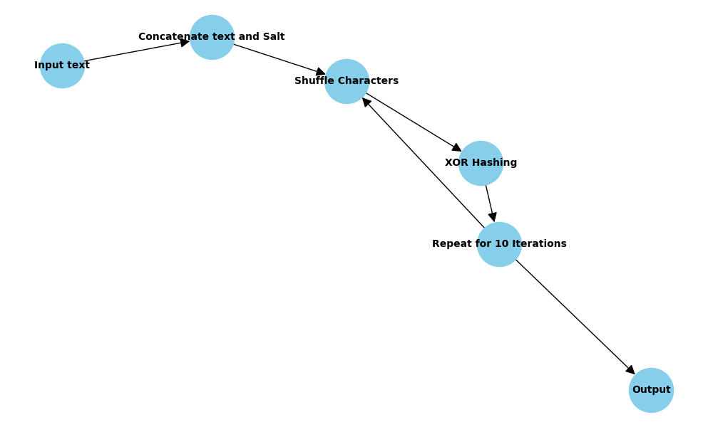

# Folder Encryption/Decryption Script V2 for Raspberry Pi

This script provides a simple way to encrypt and decrypt folders using the AES algorithm with PBKDF2 for key derivation. It utilizes OpenSSL for encryption and decryption processes. The script is designed to run on a Raspberry Pi, but it can be used on any Linux-based system.

Youtube Video: [Encryption on Raspberry pi](https://youtu.be/KQOr3ikgw-M)

### Hashing Algorithm Flowchart

This flowchart illustrates the steps of the hashing algorithm:

### License

This project is licensed under the [MIT License](https://www.mit.edu/~amini/LICENSE.md).

